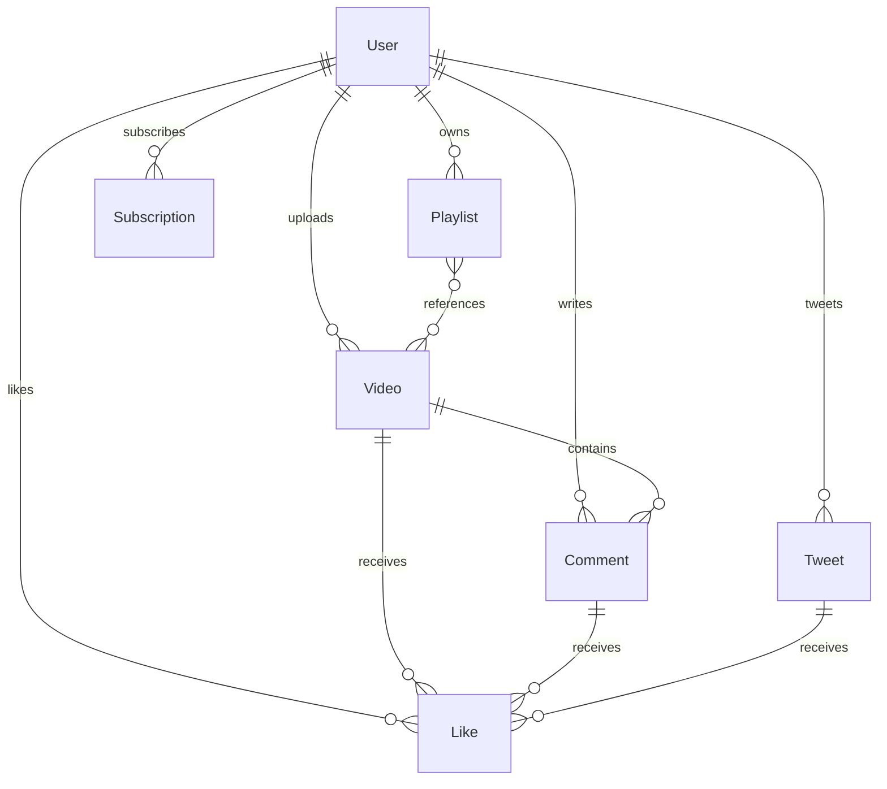

# Video & Content Platform Backend API

A production-ready, highly optimized, and scalable backend API engineered for a video sharing and social engagement platform (resembling YouTube/Twitter). This system handles video storage, user authentication, interactive social feeds, subscriptions, comments, likes, playlists, and channel analytics, all designed with clean routing and robust database aggregations.

---

## Overview

The Core Video Engine API provides a backend architecture using Node.js, Express, and MongoDB. The system utilizes industry-standard design patterns, combining token-based authentication (JWTs stored in secure, HTTP-only cookies), local file upload staging via Multer, and cloud asset transformation and delivery through Cloudinary CDN. The application structure enforces strict separation of concerns among routes, controllers, middleware, utility helpers, and database models.

---

## Features

### Authentication & Authorization
- **Secure JWT Flow**: Custom double-token system with access and refresh tokens. Access tokens are short-lived, while refresh tokens can retrieve new session tokens.
- **Client Transmission**: Tokens are delivered through secure, `httpOnly` cookies to protect client sessions against Cross-Site Scripting (XSS).
- **Hashed Credentials**: Passwords are securely hashed before insertion into the database using a Mongoose pre-save hook and verified using `bcrypt` comparison.

### Content Management
- **Video Management**: Seamlessly upload videos and thumbnails via local staging (Multer) to Cloudinary. Videos track views, owner association, and publish flags (`isPublished`).
- **Tweets Feed**: Microblogging capabilities allowing users to create, update, delete, and view their tweets.
- **Playlist System**: Aggregate multiple videos into personalized playlists with options to create, modify, add, or remove videos.
- **Interactive Comments**: Threaded interactions enabling users to comment on specific videos, with paginated aggregates.
- **Like Mappings**: Toggleable likes across videos, comments, and tweets.
- **Channel Subscriptions**: User-to-user channels mappings tracking subscribers and channel counts.

### Database & Performance
- **Indexed Schemas**: Key fields such as `username` and `fullName` are indexed in MongoDB to ensure faster lookup speeds.
- **Complex Aggregations**: Uses MongoDB aggregation pipelines to compile channel statistics (views, subscribers, likes) and user watch histories.
- **Pagination Support**: Integrated pagination for heavy database outputs (videos, comments) via `mongoose-aggregate-paginate-v2`.

### Developer Experience
- **ES Modules**: Modern ES6 import/export syntax for clean, standard modules.
- **Live Reloading**: Structured `nodemon` commands configuration with environment variables parsed on execution.
- **Code Consistency**: Formatted strictly according to Prettier formatting guidelines.

---

## Tech Stack

### Backend Core
- **Node.js**: Asynchronous JavaScript runtime environment.
- **Express.js (v5.1.0)**: Fast, minimalist web framework for building APIs.

### Database
- **MongoDB**: Document-based, NoSQL database.
- **Mongoose (v8.14.2)**: Elegant MongoDB object modeling for Node.js.
- **Mongoose Aggregate Paginate v2 (v1.1.4)**: Query pagination helper for aggregations.

### Authentication & Security
- **Bcrypt (v6.0.0)**: Hashing algorithm for password security.
- **JSON Web Tokens (v9.0.2)**: Access/Refresh session token generation.
- **CORS (v2.8.5)**: Cross-Origin Resource Sharing configuration.
- **Cookie-Parser (v1.4.7)**: Parsing cookie headers and signing data.

### Storage & Uploads
- **Cloudinary (v2.6.1)**: Media management and optimization platform.
- **Multer (v1.4.5-lts.2)**: Middleware for handling multipart/form-data.

### Dev Tools
- **Nodemon**: Local developer file-change watcher.
- **Prettier**: Code formatter.

---

## Folder Structure

Below is the structured layout of the backend application:

```
backend/
├── public/                  # Staging directory for temporary file uploads
│   └── temp/
│       └── .gitkeep         # Preserves empty staging folder in Git tracking
├── src/
│   ├── controllers/         # Handles request logic and orchestrates models/responses
│   │   ├── comment.controller.js
│   │   ├── dashboard.controller.js
│   │   ├── healthcheck.controller.js
│   │   ├── like.controller.js
│   │   ├── playlist.controller.js
│   │   ├── subscription.controller.js
│   │   ├── tweet.controller.js
│   │   ├── user.controller.js
│   │   └── video.controller.js
│   ├── db/                  # Database connections setup
│   │   └── index.js
│   ├── middlewares/         # Pre-route middleware (JWT validation, file upload)
│   │   ├── auth.middleware.js
│   │   └── multer.middleware.js
│   ├── models/              # Mongoose DB schemas and business rules
│   │   ├── comment.model.js
│   │   ├── like.model.js
│   │   ├── playlist.model.js
│   │   ├── subscription.model.js
│   │   ├── tweet.model.js
│   │   ├── user.model.js
│   │   └── video.model.js
│   ├── routes/              # Express route configurations mapping to controllers
│   │   ├── comment.routes.js
│   │   ├── dashboard.routes.js
│   │   ├── healthcheck.routes.js
│   │   ├── like.routes.js
│   │   ├── playlist.routes.js
│   │   ├── subscription.routes.js
│   │   ├── tweet.routes.js
│   │   ├── user.routes.js
│   │   └── video.routes.js
│   ├── app.js               # Instantiates Express application and core middlewares
│   ├── constants.js         # Constant project configurations
│   └── index.js             # Application entry point (connects DB and starts server)
├── .env                     # Local environment settings (git-ignored)
├── .gitignore               # Excludes files/directories from Git version control
├── .prettierignore          # Files excluded from Prettier formatting
├── .prettierrc              # Prettier config specifications
├── package.json             # Scripts, metadata, and dependency definitions
└── package-lock.json        # Auto-generated dependency locking manifest
```

---

## Architecture

The application implements a clean, layered architectural request flow:

```
Request 
  ↓
Routes (Checks HTTP endpoints)
  ↓
Middleware (Authenticates JWT and uploads local files via Multer)
  ↓
Controllers (Orchestrates queries, file pipelines, and data verification)
  ↓
Services / Utilities (Interacts with third-party tools like Cloudinary and runs helper methods)
  ↓
Database (Performs Mongoose/MongoDB persistence)
```

1. **Request Reception**: An incoming API request lands on the designated route in `src/routes/`.
2. **Middleware Execution**: The request passes through pre-processing layers such as CORS verification, cookie-parsing, JWT authentication checks in [auth.middleware.js](src/middlewares/auth.middleware.js), or file upload preparation in [multer.middleware.js](src/middlewares/multer.middleware.js).
3. **Controller Handling**: The request context is handed to controllers in `src/controllers/`. The controller validates request parameters, delegates complex operations to utilities (e.g., Cloudinary uploads), queries the database models, and generates standard payloads.
4. **Utility Integration**: Helper systems in `src/utils/` standardize error tracking ([ApiError.js](src/utils/ApiError.js)) or responses ([ApiResponse.js](src/utils/ApiResponse.js)).
5. **Database Interaction**: Mongoose schemas in `src/models/` map structures to MongoDB collections, invoking pre-hooks (like password hashing) and validation before write completion.

---

## API Overview

The API endpoints are organized into modular domains:

### 🩺 Healthcheck
Checks system status and database responsiveness.
- **Route Namespace**: `/api/v1/healthcheck`
- **File References**: [healthcheck.routes.js](src/routes/healthcheck.routes.js) | [healthcheck.controller.js](src/controllers/healthcheck.controller.js)

### 👤 Users
Handles user identity, credentials, channel profiles, and watch histories.
- **Route Namespace**: `/api/v1/users`
- **File References**: [user.routes.js](src/routes/user.routes.js) | [user.controller.js](src/controllers/user.controller.js)

### 📹 Videos
Controls video publishing, updates, toggle visibility, and metadata retrieval.
- **Route Namespace**: `/api/v1/videos`
- **File References**: [video.routes.js](src/routes/video.routes.js) | [video.controller.js](src/controllers/video.controller.js)

### 💬 Comments
Manages post comments, updates, deletions, and video-associated comment feeds.
- **Route Namespace**: `/api/v1/comments`
- **File References**: [comment.routes.js](src/routes/comment.routes.js) | [comment.controller.js](src/controllers/comment.controller.js)

### 👍 Likes
Provides toggle likes for videos, comments, and tweets, and tracks a user's liked videos.
- **Route Namespace**: `/api/v1/likes`
- **File References**: [like.routes.js](src/routes/like.routes.js) | [like.controller.js](src/controllers/like.controller.js)

### 📁 Playlists
Creates and manages video playlists (creating playlists, adding/removing videos, updating metadata, and fetching collections).
- **Route Namespace**: `/api/v1/playlist`
- **File References**: [playlist.routes.js](src/routes/playlist.routes.js) | [playlist.controller.js](src/controllers/playlist.controller.js)

### 🔔 Subscriptions
Tracks subscription events between subscribers and target channels.
- **Route Namespace**: `/api/v1/subscriptions`
- **File References**: [subscription.routes.js](src/routes/subscription.routes.js) | [subscription.controller.js](src/controllers/subscription.controller.js)

### 🐦 Tweets
Provides user-authored text posts, updates, deletions, and user-specific timelines.
- **Route Namespace**: `/api/v1/tweets`
- **File References**: [tweet.routes.js](src/routes/tweet.routes.js) | [tweet.controller.js](src/controllers/tweet.controller.js)

### 📊 Dashboard
Fetches channel creator stats (total views, videos, subscribers, and likes) and channel content dashboards.
- **Route Namespace**: `/api/v1/dashboard`
- **File References**: [dashboard.routes.js](src/routes/dashboard.routes.js) | [dashboard.controller.js](src/controllers/dashboard.controller.js)

---

## Database Design

The database represents a MongoDB relational document structure modeled using Mongoose schemas:



### Models & Properties

| Model | Collection Field | Data Type | Key Associations |
| :--- | :--- | :--- | :--- |
| **User** | `watchHistory` | Array of ObjectIds | References `Video` |
| **Video** | `owner` | ObjectId | References `User` (Required) |
| **Comment** | `video`, `owner` | ObjectId, ObjectId | References `Video`, `User` (Required) |
| **Like** | `video`, `comment`, `tweet`, `likedBy` | ObjectId (all fields) | References `Video`, `Comment`, `Tweet`, `User` |
| **Playlist** | `videos`, `owner` | Array of ObjectIds, ObjectId | References `Video`, `User` |
| **Subscription** | `subscriber`, `channel` | ObjectId, ObjectId | References `User`, `User` (Required) |
| **Tweet** | `owner` | ObjectId | References `User` |

- **User**: Stores email, indexed user handles (`username`), profiles (avatar and cover image URLs hosted on Cloudinary), hashed passwords, and user tokens.
- **Video**: Tracks upload details (Cloudinary files, titles, descriptions, durations, view counts, and publishing state).
- **Subscription**: Joint junction table tracking relationships from a subscriber ID (`subscriber`) to a host channel ID (`channel`).
- **Like**: Polymorphic linking matching liked items (`video`, `comment`, `tweet`) to liking users (`likedBy`).

---

## Error Handling

The codebase enforces error consistency by using:
1. **Custom ApiError Class**: The [ApiError.js](src/utils/ApiError.js) utility extends the native JS `Error` class, capturing execution call stack traces and appending standard properties:
   - `statusCode`: HTTP Status code (e.g. 400, 401, 404, 500)
   - `success`: Statically set to `false`
   - `errors`: Holds detailed array items explaining the exact validation failures.
2. **Standardized Controller Wrapper**: The [asyncHandler.js](src/utils/asyncHandler.js) wrapper takes controller actions, wraps them in a resolved Promise, catches exceptions, and maps them directly into formatted JSON payloads.
3. **Structured API Responses**: All successful resolutions use the [ApiResponse.js](src/utils/ApiResponse.js) class, creating a consistent response structure:
   ```json
   {
     "status": 200,
     "success": true,
     "message": "Data retrieved successfully",
     "data": { ... }
   }
   ```

---

## Getting Started

### Prerequisites
- **Node.js**: >= 18
- **MongoDB Atlas**: Or a local MongoDB instance
- **Cloudinary**: Account for media storage and transformation

### Installation & Setup

1. **Clone the Repository**
   ```bash
   git clone https://github.com/rishank14/backend.git
   cd backend
   ```

2. **Install Dependencies**
   ```bash
   npm install
   ```

3. **Configure Environment Variables**
   Create a `.env` file in the root directory:
   ```env
   PORT=3000
   MONGODB_URI=mongodb+srv://<username>:<password>@cluster.mongodb.net/videotube
   CORS_ORIGIN=http://localhost:5173
   ACCESS_TOKEN_SECRET=your_access_token_secret_here
   ACCESS_TOKEN_EXPIRY=1d
   REFRESH_TOKEN_SECRET=your_refresh_token_secret_here
   REFRESH_TOKEN_EXPIRY=10d
   CLOUDINARY_CLOUD_NAME=your_cloudinary_cloud_name_here
   CLOUDINARY_API_KEY=your_cloudinary_api_key_here
   CLOUDINARY_API_SECRET=your_cloudinary_api_secret_here
   ```

4. **Start the Server**
   ```bash
   npm run dev
   ```
   The backend will be running at `http://localhost:3000`.

---

## License

This project is licensed under the [MIT License](LICENSE).

---

## Author

**Rishank Kalra**